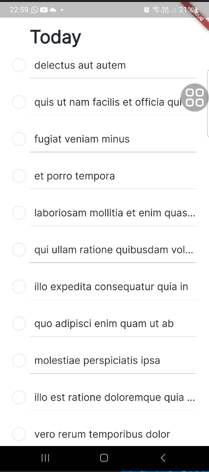

# :pencil2: todo_app

Este aplicativo foi criado com o intuito de facilitar a realização de testes de unidade, widgets e integração. O app é dividido em módulos para melhor organização, com uma arquitetura simples que segue os princípios do SOLID. Essa abordagem torna mais fácil a aplicação de testes, garantindo uma maior facilidade no processo.

## :heavy_check_mark: Telas do projeto

  

## :computer: Tecnologias, APIs, Packages utilizados:
      
  * Flutter / Dart
  * MiniCore architecture
  * dio
  * google_fonts
  * geolocator
  * lottie
  * get_it
  * mocktail
  * integration_test

